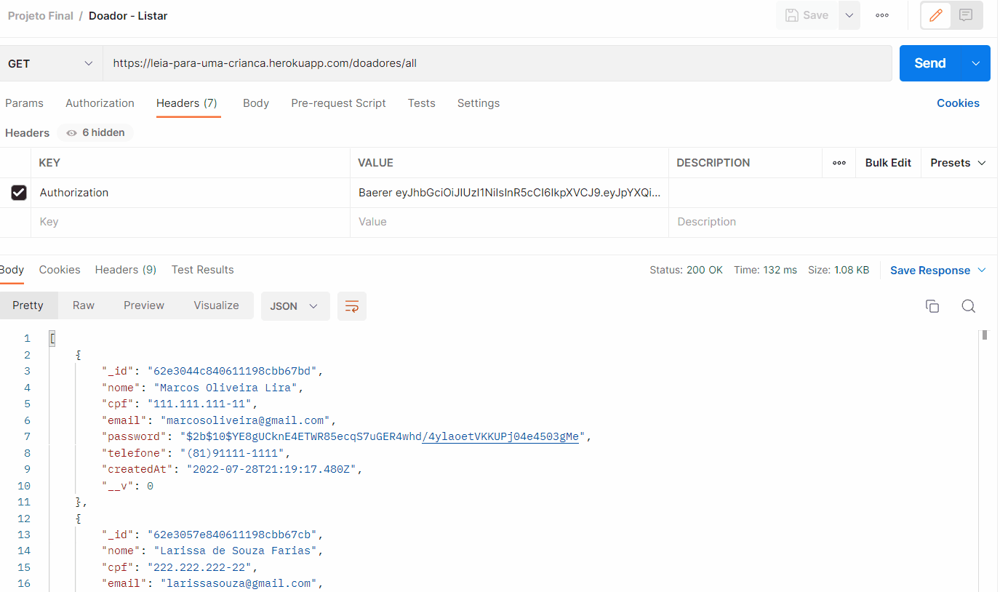
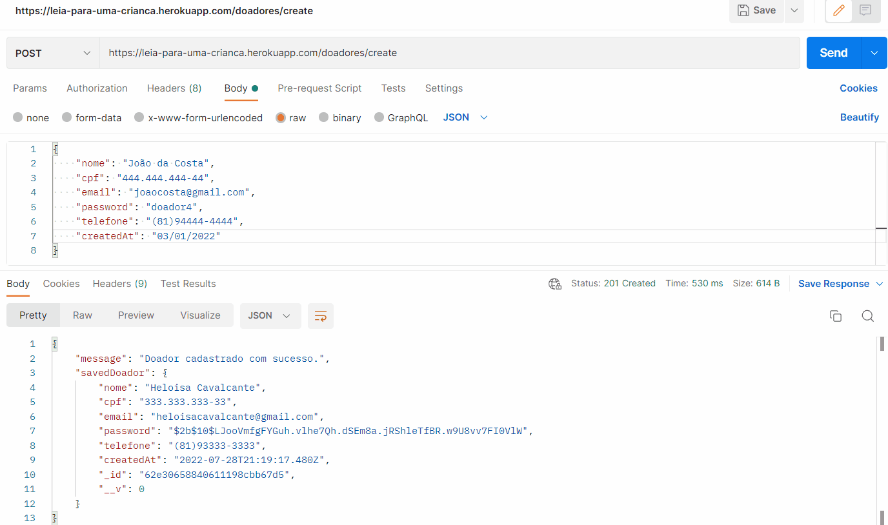
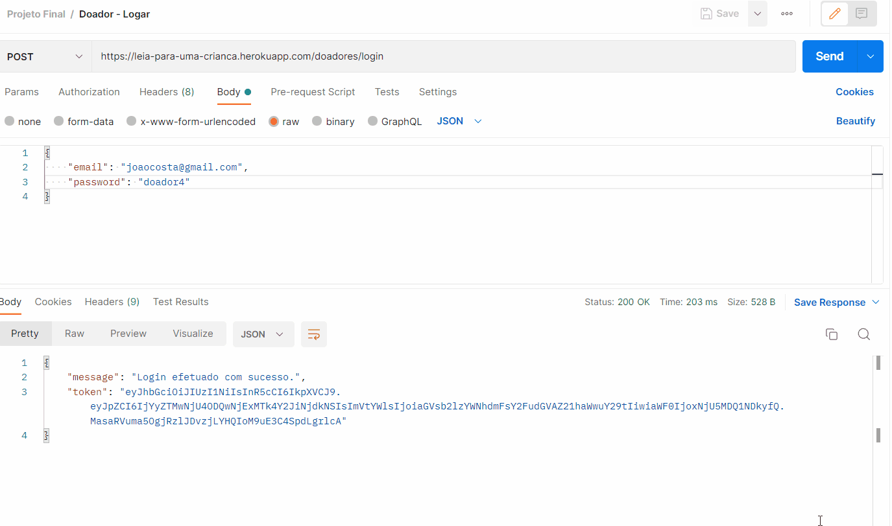
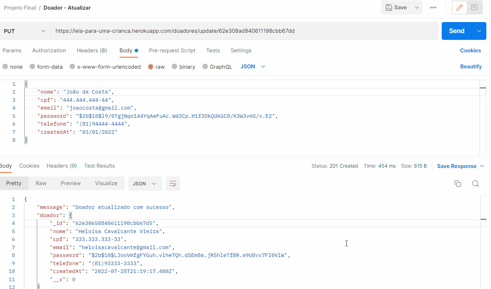
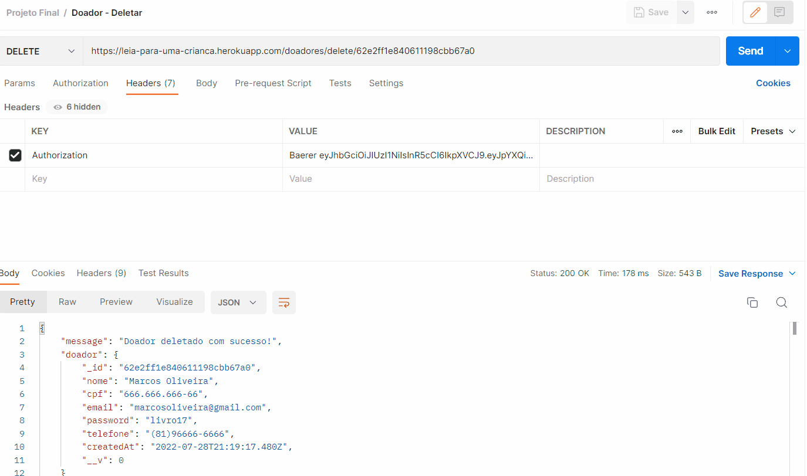

# Projeto Final {Reprograma} Todas em Tech Back-end - Turma ON15

># - Leia para uma Criança

## Introdução
O projeto "Leia para uma Criança" foi feito de forma a estimular o aumento da leitura em crianças de diversas idades que estejam em situação de vulneralidade social no Brasil. 

A ideia do projeto surgiu a partir múltiplos fatores que fui observando ao longo do tempo. Entre eles, há o fato de que eu estudo em uma faculdade de saúde, onde participei de um estágio com duração de um mês em uma ONG chamada OAF (Organização de Auxílio Fraterno), na qual acolhe e atende, principalmente na educação, de crianças e adolescentes carentes. Lá pude presenciar como as crianças eram animadas, gostavam de brincar, conversar e ler, pois lá tinha uma biblioteca cheia de livros que elas adoravam, pois enxergavam aquilo como forma de escape de sua realidade. Além disso, eles também tinham sessão de leitura em grupo que os professores organizavam, como forma de desenvolver esse hábito de leitura, pois ela ajuda no raciocínio, vocabulário, capacidade interpretativa, criatividade, imaginação, comunicação e senso crítico.

Nesse contexto, é preocupante que cada vez mais o uso excessivo de eletrônicos pelas crianças, pois ele prejudica e muito seu devenvolvimento de diversas formas: diminuição da capacidade de comunicação e sociabilidade, ela pode exposta à conteúdos inadequados para a idade, insônia e agressidade e predisposição para transtornos psicológicos. Além disso, esse uso ocorre muitas vezes porque os pais dão o celular para a criança ficar distraída enquanto eles vão trabalhar. Por isso que é importante estimular a leitura nas crianças, pois de ser uma forma de lazer, trará benefícios em vez de prejuízos.

Logo, o projeto seria uma API que permite que doadores de livros realizem seu cadastro, façam o login, atualizem o cadastro e deletem o cadastro, além de listar todos os doadores que estão cadastrados. As ONGs interessadas também poderão se cadastrar, logar, atualizar e deletar seu cadastro, além de também listar para ver todas as ONGs. Após isso, o doador poderá cadastrar, listar, atualizar e deletar seus livros, para que as ONGs que possam ver quais estão disponíveis para doação e entrar em contato com o doador e vice e versa.

## Tecnologias Usadas no Projeto

<br>

- [JavaScript](https://www.javascript.com/)
- [Git/Github](https://github.com/)
- [Node.js](https://nodejs.org/en/)
- [MongoDb](https://www.mongodb.com/)
- [MongoDBatlas](https://www.mongodb.com/cloud/atlas)
- [Postman](https://www.postman.com/)
- [Vscode](https://code.visualstudio.com/)
- [heroku](https://dashboard.heroku.com/apps)

<br>

## Pacotes Usados no Projeto

<br>

- [Express](https://expressjs.com/pt-br/)
- [Nodemon](https://nodemon.io/)
- [dotenv](https://www.npmjs.com/package/dotenv)
- [Mongoose](https://mongoosejs.com/)
- [cors](https://www.npmjs.com/package/cors)
- [nodemon](https://www.npmjs.com/package/nodemon)

<br>

## Arquitetura MVC

```
   |- 📁 images
   |    |- 📑 Doador_Atualizar_PUT.gif
   |    |- 📑 Doador_Cadastrar_POST.gif
   |    |- 📑 Doador_Deletar_DELETE.gif
   |    |- 📑 Doador_Listar_GET.gif
   |    |- 📑 Doador_Logar_POST.gif
   | 
   |- 📁 src
   |    |
   |    |- 📁 controllers
   |         |- 📑 authController.js
   |         |- 📑 doadorController.js
   |         |- 📑 livroController.js
   |         |- 📑 ongController.js
   |
   |    |- 📁 database
   |         |- 📑 mongoConfig.js
   |
   |    |- 📁 helpers
   |         |- 📑 hashPassword.js
   |     
   |    |  - 📁 middlewares
   |         |- 📑 auth.js
   |
   |    |  - 📁 models
   |         |- 📑 doadorModel.js
   |         |- 📑 livroModel.js
   |         |- 📑 OngModel.js
   |
   |    |  - 📁 routes
   |         |- 📑 doadorRoutes.js
   |         |- 📑 livroRoutes.js
   |         |- 📑 ongRoutes.js
   | 
   |    |- 📁 test
   |         |- 📑 api.test.js
   |
   |
   |    |- 📑 app.js
   |
   |
   |
   |- 📑 .env
   |- 📑 .gitignore
   |- 📑 package-lock.json
   |- 📑 package.json
   |- 📑 Procfile
   |- 📑 README.md
   |- 📑 server.js

```
<br>

## Passo a Passo para Usar a API
### 1º - Clonar o Repositório
```sh
git clone https://github.com/DeborahTorres19/Leia_para_uma_Crianca.git
```

### 2º - Instalar dependências
```sh
npm i
```

### 3º - Configurar o ambiente
Aqui é necessário duplicar o arquivo `.env.example` e o renomear para `.env`.</br>
Após isso, mude as informações que estavam no arquivo `.env` para as correspondentes de sua máquina, nesse caso, as informações para PORT da porta, MONGO_URI com a URL do MongoDb e SECRET para o secret.

### 4º - Começar a Aplicação
```sh
npm start
```

## Rotas

| Método HTTP | Endpoint           | Descrição                                                 |
| ----------- | ------------------ | --------------------------------------------------------- |
| GET         | `/doadores/all`             | Listagem de todos os doadores           |
| POST        | `/doadores/create`          | Realiza o cadastro do doador.              |
| POST        | `/doadores/login`         | Realiza o login do doador.             |
| PUT         | `/doadores/update/:id`         | Realiza a atualização do doador.              |
| DELETE        | `/doadores/delete/:id`      | Deleta o doador.              |

| Método HTTP | Endpoint           | Descrição                                                 |
| ----------- | ------------------ | --------------------------------------------------------- |
| GET         | `/livros/all`          | Listagem de todos os livros.              |
| POST       | `/livros/create` | Realiza o cadastro do livro.              |
| PUT      | `/livros/update/:id`      | Realiza a atualização do livro.             |
| DELETE      | `/livros/delete/:id`      | Deleta o livro.             |

| Método HTTP | Endpoint           | Descrição                                                 |
| ----------- | ------------------ | --------------------------------------------------------- |
| GET         | `/ongs/all`             | Listagem de todas as ongs.           |
| POST        | `/ongs/create`          | Realiza o cadastro da ong.              |
| POST        | `/ongs/login`         | Realiza o login da ong.             |
| PUT         | `/ongs/update/:id`         | Realiza a atualização da ong.              |
| DELETE        | `/ongs/delete/:id`      | Deleta a ong.              |

## Gifs de Rotas
### Rota GET no Postman

<h1 align="center">
  
<p align="center"><p>
</h1>

<br>

<br>

### Rota POST/Cadastro no Postman

<h1 align="center">
  
<p align="center"><p>
</h1>

<br>

<br>

### Rota POST/Login no Postman

<h1 align="center">
  
<p align="center"><p>
</h1>

<br>

<br>

### Rota PUT no Postman

<h1 align="center">
  
<p align="center"><p>
</h1>

<br>

<br>

### Rota DELETE no Postman

<h1 align="center">
  
<p align="center"><p>
</h1>

<br>

<br>

## Implementações Futuras
- Utilizar os testes nas rotas
- Descobrir como implementar do front-end
- Construir para além das ONGs, expandindo para escolas e bibliotecas públicas

## Agradecimentos
Entrei no bootcamp da {Reprograma} sem ter certeza do que encontraria, sou uma pessoa que ainda estou me descobrindo profissionalmente, principalmente por ter finalizado o ensino médio a pouco tempo. Então, cheguei aqui com o objetivo de tentar algo novo que me possibilitasse me encontrar nesse mercado de trabalho, e isso me possibilitou embarcar nessa enorme "montanha-russa" que é a {Reprograma}.

Desespero, alegria, tristeza, euforia, o bootcamp foi cheio de altos e baixos que me fez conhecer pessoas incríveis e que vão chegar muito longe nesse mundo das desenvolvedoras back-end. Esse foi um momento que nunca me esquecerei e vai contribuir e muito na minha carreira profissional. 
Gostaria  de agradecer a todas as professoras, especialmente a Hannah que me ajudou muito nessa etapa do projeto final, e monitoras que nos auxiliaram durante esse processo, além da coordenação do curso que sempre estava nos ajudando quando precisamos, e nossa incrível BTL Jess Guerra que nos acompanhou desde o início.

## Autora
Deborah Torres da Costa Lira, estudante de psicologia e de desenvolvimento back-end.

- [LinkedIn](https://www.linkedin.com/in/deborah-torres-12384921a/)
- [GitHub](https://github.com/DeborahTorres19)